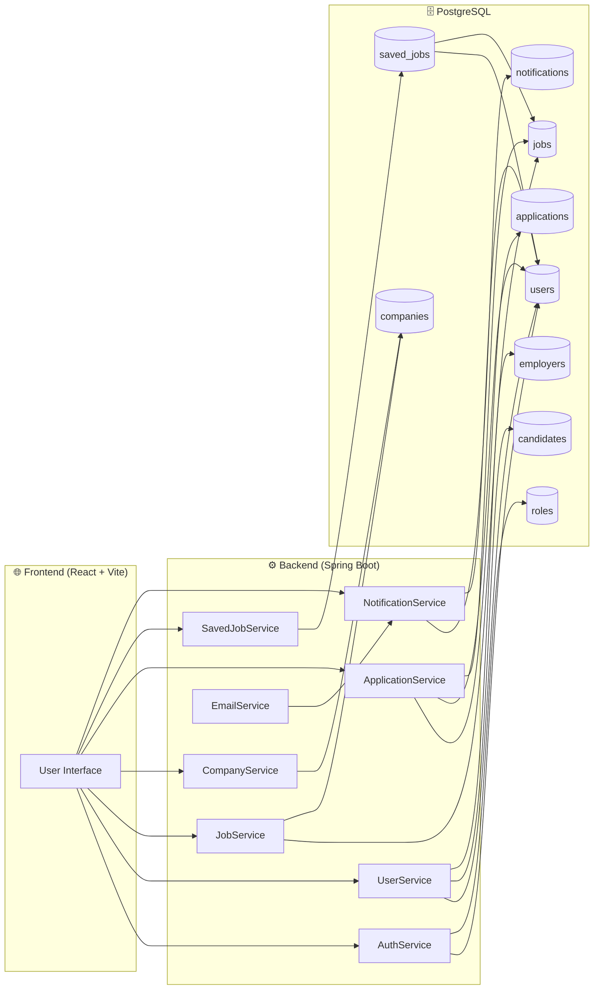
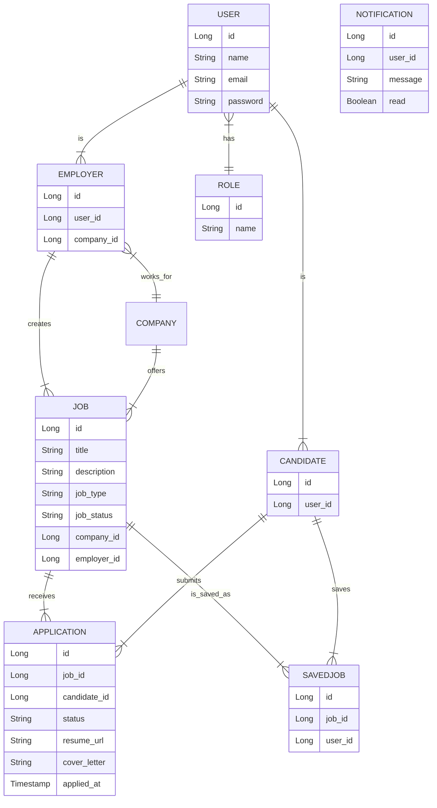

### 🚀 Job Portal – Full Stack Web Application

    A modern full-stack recruitment platform built with Spring Boot, React (Vite), and PostgreSQL.
    It connects candidates, employers, and admins through a clean, secure, and scalable system. 
------------------------------------------------------------------------------------------------------------
### ⭐ Features
  #### 👨‍🎓 Candidates
  
    Browse & filter jobs (location, type, experience, keywords)
    View job details with company info
    Apply with cover letter + resume upload
    Track application status
    Save jobs for later
    Manage profile

  #### 👨‍💼 Employers
    
    Create & manage job posts
    View applicants per job
    Update application status:
    Pending → Reviewed → Shortlisted → Accepted → Rejected
    Company profile management
    Email notifications to candidates

  #### 🛡️ Admins

    Manage users, companies, jobs, and applications
    View platform-wide statistics
    Complete system oversight
------------------------------------------------------------------------------------------------------------
### 🏗️ System Architecture

-------------------------------------------------------------------------------------------------
📊 Data Model (ER Diagram)

----------------------------------------------------------------------------------------------

