### 🚀 Job Portal – Full Stack Web Application

    A modern full-stack recruitment platform built with Spring Boot, React (Vite), and PostgreSQL.
    It connects candidates, employers, and admins through a clean, secure, and scalable system. 
------------------------------------------------------------------------------------------------------------
### ⭐ Features
  #### 👨‍🎓 Candidates
  
    Browse & filter jobs (location, type, experience, keywords)
    View job details with company info
    Apply with cover letter + resume upload
    Track application status
    Save jobs for later
    Manage profile

  #### 👨‍💼 Employers
    
    Create & manage job posts
    View applicants per job
    Update application status:
    Pending → Reviewed → Shortlisted → Accepted → Rejected
    Company profile management
    Email notifications to candidates

  #### 🛡️ Admins

    Manage users, companies, jobs, and applications
    View platform-wide statistics
    Complete system oversight
------------------------------------------------------------------------------------------------------------
### 🏗️ System Architecture

```mermaid
flowchart LR

    %% ======================= CLIENT ======================
    subgraph Client["🌠Frontend (React + Vite)"]
        UI["User Interface"]
    end

    %% ======================= BACKEND ======================
    subgraph Server["âš™ï¸ Backend (Spring Boot)"]
        AuthService["AuthService"]
        UserService["UserService"]
        JobService["JobService"]
        CompanyService["CompanyService"]
        ApplicationService["ApplicationService"]
        SavedJobService["SavedJobService"]
        NotificationService["NotificationService"]
        EmailService["EmailService"]
    end

    %% ======================= DATABASE ======================
    subgraph DB["🗄 PostgreSQL"]
        UserTable[(users)]
        CompanyTable[(companies)]
        JobTable[(jobs)]
        CandidateTable[(candidates)]
        EmployerTable[(employers)]
        ApplicationTable[(applications)]
        SavedJobTable[(saved_jobs)]
        NotificationTable[(notifications)]
        RoleTable[(roles)]
    end

    %% ======================= UI TO API =====================
    UI --> AuthService
    UI --> UserService
    UI --> JobService
    UI --> CompanyService
    UI --> ApplicationService
    UI --> SavedJobService
    UI --> NotificationService

    %% ======================= SERVICES TO DATABASE ==========
    AuthService --> UserTable
    AuthService --> RoleTable

    UserService --> UserTable
    UserService --> CandidateTable
    UserService --> EmployerTable

    CompanyService --> CompanyTable

    JobService --> JobTable
    JobService --> CompanyTable

    ApplicationService --> ApplicationTable
    ApplicationService --> UserTable
    ApplicationService --> JobTable

    SavedJobService --> SavedJobTable
    SavedJobTable --> UserTable
    SavedJobTable --> JobTable

    NotificationService --> NotificationTable
    NotificationService --> UserTable

    EmailService --> NotificationService
```

-------------------------------------------------------------------------------------------------
## 🧩 Backend Layered Architecture

```mermaid
flowchart TB

    subgraph Controller["🎯 Controller Layer"]
        AuthController
        UserController
        JobController
        CompanyController
        ApplicationController
        SavedJobController
        NotificationController
    end

    subgraph Service["🧠 Service Layer"]
        AuthService
        UserService
        JobService
        CompanyService
        ApplicationService
        SavedJobService
        NotificationService
        EmailService
    end

    subgraph Repo["📦 Repository Layer"]
        UserRepo
        RoleRepo
        CompanyRepo
        JobRepo
        CandidateRepo
        EmployerRepo
        ApplicationRepo
        SavedJobRepo
        NotificationRepo
    end

    subgraph DB["🗄 PostgreSQL Database"]
        Users[(users)]
        Roles[(roles)]
        Companies[(companies)]
        Jobs[(jobs)]
        Candidates[(candidates)]
        Employers[(employers)]
        Applications[(applications)]
        SavedJobs[(saved_jobs)]
        Notifications[(notifications)]
    end

    Controller --> Service
    Service --> Repo
    Repo --> DB
```

----------------------------------------------------------------------------------------------

